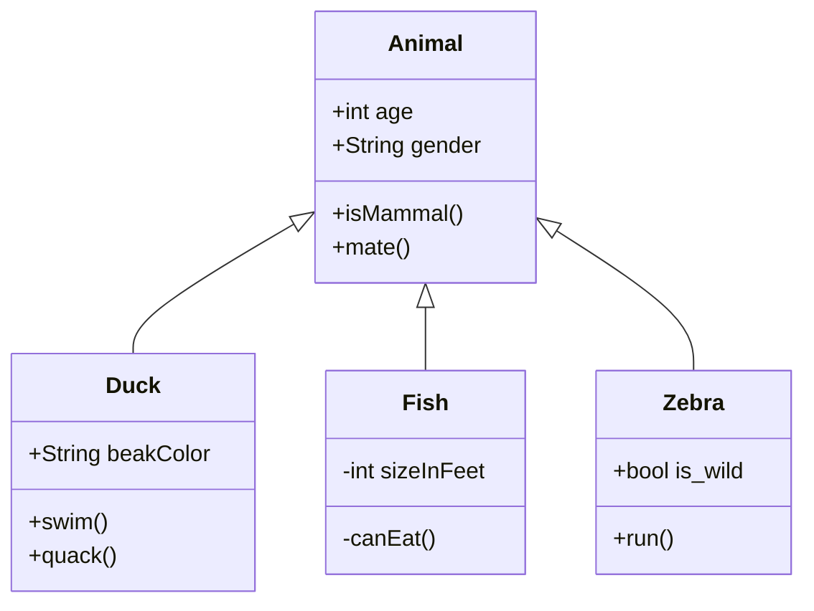

# 一、标题

# 这是一级标题 \# + 空格

## 这是二级标题 \## + 空格

### 这是三级标题 \### + 空格

### 这是四级标题 \#### + 空格

##### 这是五级标题 \##### + 空格

# 二、字体

- **加粗(Ctrl+B)**

  - 要加粗的字体左右分别用 “ \*\* ”包起来
  - **标题自动加粗**
  - 例：**加粗字体**

- **斜体(Ctrl+I)**

  - 要倾斜的字体左右分别用 ” \* “ 包起来
  - 例：_这是斜体_

- **斜体加粗**

  - 要倾斜和加粗的文字左右分别用 ” \*\*\* “ 包起来
  - 例：**_这是倾斜并加粗的字体_**

- ~~**删除线**~~
  - 要加删除线的文字左右分别用 ”~~“ 包起来
  - 例：~~删除线字体~~
- **<u>下划线</u>（Ctrl+U）**

# **三、引用(Ctrl+Shift+Q)**

在引用的文字前加>即可。引用也可嵌套，如两个>>三个>>>

- 实例：

  - > 这是一级引用
    >
    > > 这是二级引用
    > >
    > > > > > > > 这是 n 级引用

# 四、分割线

三个或以上的 - 或者 \* 都可以

- 实例：

---

---

---

# 五、图片

## 语法(Ctrl+Shift+I)

\![图片底注]\(图片地址 "图片标题")

- 实例：


> 搜索图床以将图片保留到云端，这样其他用户可以看到。

# 六、超链接

**语法（Ctrl+K）**

​ \[超链接名]\(超链接地址 \"鼠标停在超链接上的注释")， 注释可以加可以不加

- 实例：

[百度](www.baidu.com "这是注释文本")

# 七、列表

#### 无序列表（Ctrl+Shift+]）

**语法**

​ 无序列表用 - + \* 任何一种都可以，先输一个 - 和空格。

**实例**

    	- 一号无序

- 二号

* 三号

#### 有序列表(Ctrl+Shift+[)

**语法**

​ 数字加点

1.

2.

#### 列表嵌套

​ **上一级和下一级之间敲三个空格即可**

- 一级无序列表

  - 二级无序列表
    1. 三级有序列表
    2.

---

2. 3. 4. 5.

# 八、表格

**语法**

\|表头|表头|表头|，再按回车可以自动生成一个表格。Ctrl+T

**实例**

| 姓名   | 学号 | 年龄 | 班级 |
| :----- | ---- | ---- | ---- |
| 程琪滨 |      |      |      |
|        |      |      |      |
|        |      |      |      |

# 九、代码

**语法**

- 单行代码：代码之间分别用一个反引号包起来

  - \`代码内容\`
  - 实例：`public class Coding {}`

- 代码块：代码之间分别用三个反引号包起来，且两边的反引号单独占一行

  - 实例：

  ```java
  public class Coding {
  	public static void main(){
          System.out.println("Hello World!");
      }

  }
  ```

$\alpha$

```ruby
$\textcolor{Magenta}{洋红色} $:设置颜色为$\textcolor{RedOrange}{橙红色} $，设置字体颜色为$\textcolor{Blue}{蓝色} $。数学公式里各元素也能分别设置颜色：$ \textcolor{red}{\int_a^b}\textcolor{blue}{f(x)}\textcolor{green}{dx}\textcolor{brown}{=c}$
```

$\textcolor{Magenta}{洋红色} $:设置颜色为$\textcolor{RedOrange}{橙红色} $

$$
\iint_{x \rightarrow 0}^\infty \\
x = x_1+x_2 \\
$$

$\textcolor{rgb(255,159,255)}{彩色字体}$

$\color{blue}{蓝^色}$ ==python== :kissing_smiling_eyes:

$\textcolor{red}{红色}$​

# 十、播放视频

# 黑底常用舒服的字体颜色

- [x] `$\textcolor{orange}{橘色}$` $\textcolor{orange}{橘色}$
- [ ] `$\textcolor{aqua}{浅蓝色}$` $\textcolor{aqua}{浅蓝色}$
- [x] `$\textcolor{GreenYellow}{浅黄色}$` $\textcolor{GreenYellow}{浅黄色}$
- [ ] `$\textcolor{Yellow}{黄色}$` $\textcolor{Yellow}{黄色}$
- [x] `$\textcolor{CornflowerBlue}{矢车菊色}$` $\textcolor{CornflowerBlue}{矢车菊色}$
- [x] `$\textcolor{Cerulean}{Cerulean}$` $\textcolor{Cerulean}{Cerulean}$
- [x] `$\textcolor{TealBlue}{TealBlue}$` $\textcolor{TealBlue}{TealBlue}$
- [x] `$\textcolor{BlueGreen}{蓝绿色}$` $\textcolor{BlueGreen}{蓝绿色}$
- [x] `$\textcolor{LimeGreen}{柠檬绿}$` $\textcolor{LimeGreen}{柠檬绿}$
- [x] `$\textcolor{Gray}{灰色}$` $\textcolor{Gray}{灰色}$

# 时序图、流程图

[官方文档](http://support.typora.io/Draw-Diagrams-With-Markdown/)

## 用 Mermaid 绘制 Java 类图

- `<|--`表示继承
- `+`表示 public
- `-`表示 private



<center>
    居中显示
</center>
<p align="right">右对齐</p>

<p align="left">左对齐</p>

```html

```

### 在 typora 中换行

按`enter` 是换双行
按`shift+enter`是换单行

$$ A=a \bullet i+b \bullet j=[i,j] \bullet [a;b]=基\bullet 坐标 \tag{3}$$

$\color{red}{红色}$

$\backgroundcolor{black}}{大小}$


<details/>
